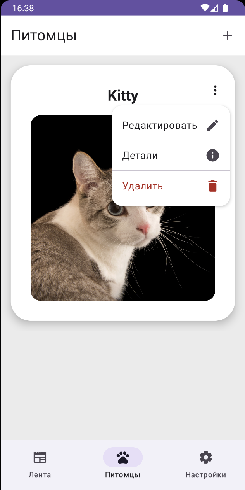
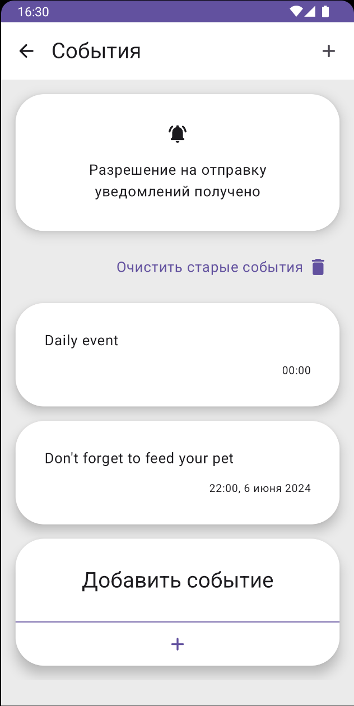
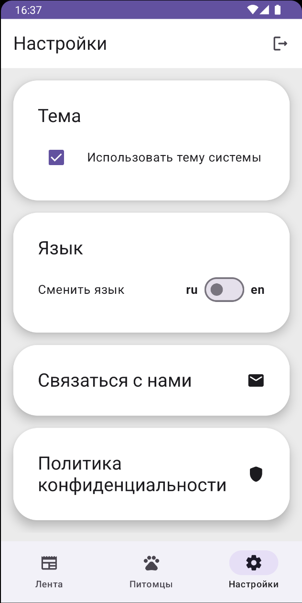

# My Little Pet

My Little Pet — это Android-приложение, созданное для помощи пользователям в уходе за их питомцами. Приложение позволяет управлять различными аспектами ухода за питомцами, включая напоминания о важных событиях, ведение заметок, сохранение медицинских данных и многое другое. 

## Основные функции:

- **Добавление и редактирование питомца**: Позволяет вносить и обновлять информацию о вашем питомце, включая имя, тип и фотографию.

- **Напоминания**: Позволяет устанавливать напоминания о любых событиях, связанных с вашим питомцем (кормление, прогулка, прием лекарств и т.д.).

  
- **Заметки**: Вы можете создавать заметки, чтобы фиксировать важную информацию о питомце, такую как особенности поведения или медицинские наблюдения.

- **Медицинские данные**: Возможность добавлять и хранить медицинскую информацию о питомце, включая данные о прививках, лекарствах и визитах к ветеринару.

- **QR-код**: Приложение генерирует уникальный QR-код для вашего питомца, содержащий всю ключевую информацию. Этот QR-код можно сканировать, чтобы просмотреть данные о питомце.

- **Авторизация через Firebase**: Поддерживается авторизация через Firebase для безопасного входа и хранения данных.

- **Кастомизация**: Приложение поддерживает смену языка и темы интерфейса для удобства пользователей.

## Технологический стек

### Основные библиотеки и версии:
- **Jetpack Compose**: Для создания современного и декларативного пользовательского интерфейса.
- **MVI Kotlin**: Для реализации архитектуры Model-View-Intent (MVI), позволяющей управлять состоянием приложения и его логикой.
- **Decompose**: Для работы с компонентами в архитектуре MVI, что помогает разделять логику между различными частями приложения и организовывать навигацию.
- **Retrofit**: Для взаимодействия с серверной частью и работы с API.
- **OkHttp**: Для логирования сетевых запросов.
- **CameraX**: Для работы с камерой, сканирования QR-кодов.
- **QR-коды (ZXing)**: Для генерации и сканирования QR-кодов.
- **Gson**: Для сериализации и десериализации данных.
- **Coil**: Для асинхронной загрузки изображений.
- **Room**: Для локальной базы данных.
- **Firebase**: Для авторизации.
